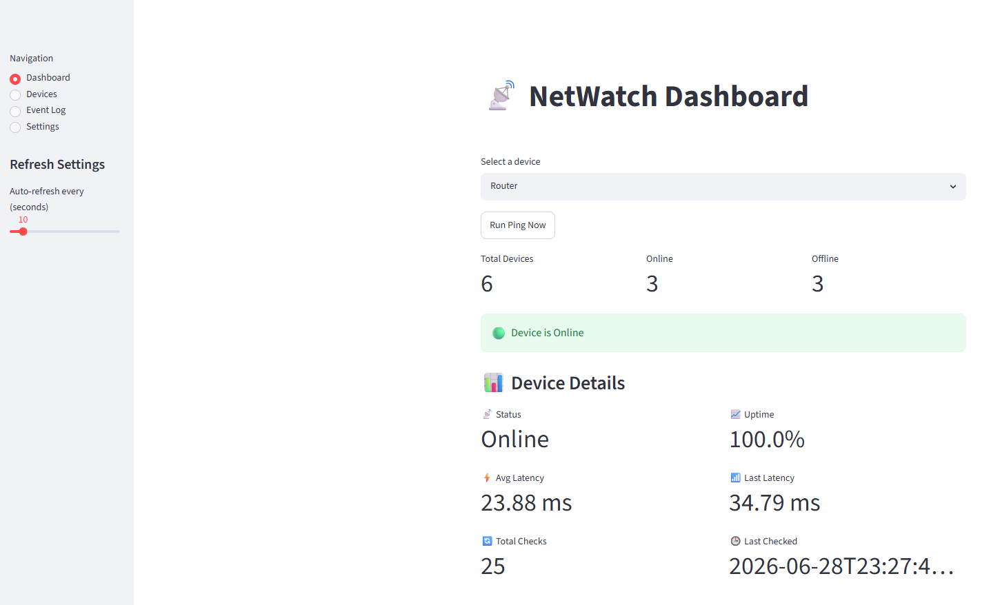
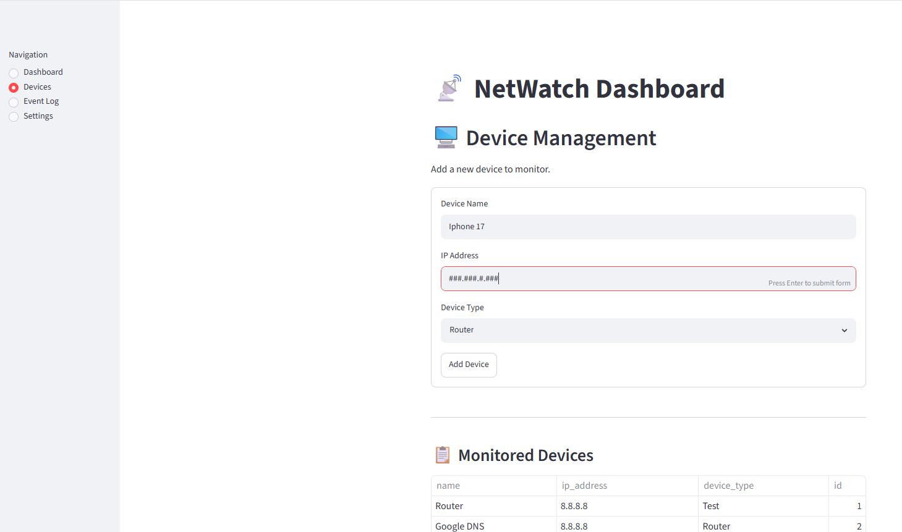

# NetWatch

NetWatch is a network monitoring application built with **Python, FastAPI, Streamlit, and SQLite**. It allows users to monitor network devices, track connectivity, measure latency, and visualize network health through an interactive dashboard.

This project was created to strengthen my skills in Python development, REST APIs, networking concepts, databases, and dashboard design while building a practical tool relevant to IT infrastructure and support roles.

---

## Screenshots

### Dashboard



### Device Management



## Features

* 📊 Interactive monitoring dashboard
* 🖥️ Add and manage monitored devices
* 🌐 FastAPI REST API backend
* 🗄️ SQLite database for device and monitoring history
* 📡 Manual ping checks
* 🟢 Online/Offline device monitoring
* ⚡ Latency tracking over time
* 📈 Uptime monitoring
* 🔄 Auto-refresh dashboard
* 📋 Dashboard summary metrics

  * Total Devices
  * Online Devices
  * Offline Devices
* 📉 Interactive latency charts
* 📊 Status timeline visualization

---

## Tech Stack

* Python
* FastAPI
* Streamlit
* SQLite
* SQLAlchemy
* Plotly
* Requests

---

## Project Architecture

```text
Streamlit Dashboard
        │
        ▼
FastAPI REST API
        │
        ▼
SQLite Database
        │
        ▼
Network Ping Engine
```

---

## Why I Built This

As I transition into a career in IT and software development, I wanted to build a project that demonstrates both programming ability and practical networking knowledge.

NetWatch combines frontend development, backend APIs, databases, and networking into a single application that simulates the type of monitoring tools used by IT departments, help desks, and data center operations teams.

---

## Current Status

Current functionality includes:

* ✅ Multi-page dashboard
* ✅ Device Management page
* ✅ Add new devices
* ✅ View monitored devices
* ✅ Run manual network checks
* ✅ Live device status monitoring
* ✅ Latency tracking
* ✅ Uptime statistics
* ✅ Interactive data visualizations
* ✅ REST API backend
* ✅ SQLite persistence

---

## Planned Improvements

* ✏️ Edit existing devices
* 🗑️ Delete devices
* 📜 Event log with searchable history
* 📧 Email alerts for offline devices
* ⚠️ Improved API error handling
* 🧪 Automated API tests
* 🐳 Docker support
* ☁️ Cloud deployment
* 📷 Dashboard screenshots
* 📖 Complete installation guide

---

## Running the Project

Clone the repository:

```bash
git clone https://github.com/ajh767676/netwatch.git
cd netwatch
```

Create and activate a virtual environment:

```bash
python -m venv venv
```

Install dependencies:

```bash
pip install -r requirements.txt
```

Start the FastAPI backend:

```bash
uvicorn app.main:app --reload
```

In a second terminal, start the Streamlit dashboard:

```bash
streamlit run dashboard.py
```

---

## Career Focus

This project is part of my software engineering portfolio as I prepare for roles such as:

* IT Support Technician
* Infrastructure Technician
* Data Center Operations
* Network Support Technician
* Systems Administrator
* Entry-Level Python Developer
* Junior Software Developer
